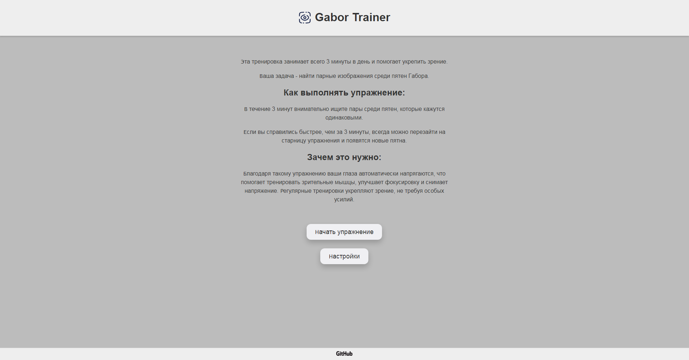
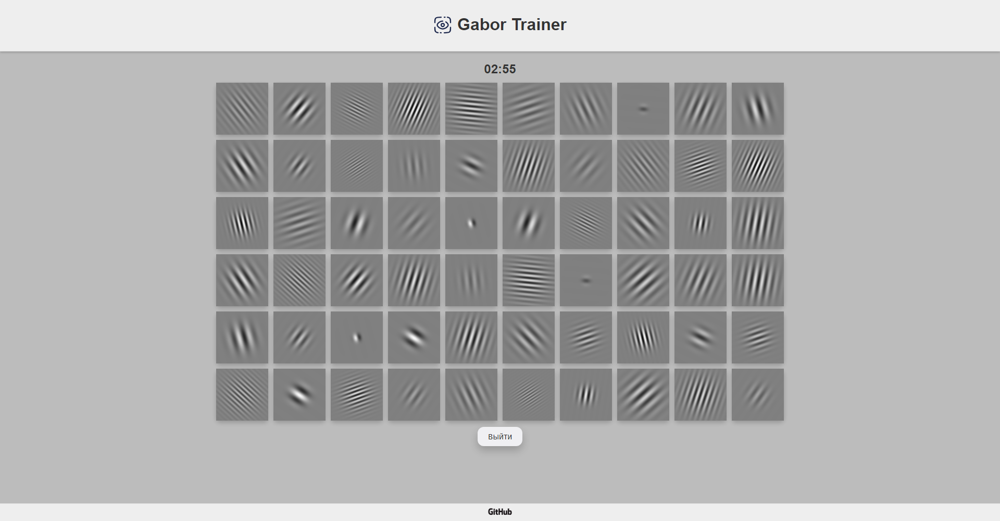

# Gabor Trainer

Gabor Trainer - это интерактивное приложение, предназначенное для улучшения зрительных и когнитивных способностей пользователей с помощью пятен Габора — техники, широко используемой в исследованиях зрения. Этот проект предоставляет тренировочную среду, позволяя пользователям тренировать зрение и развивать внимание, восприятие и память через целенаправленные упражнения с использованием пятен Габора.

## Установка

Чтобы установить и запустить проект локально, выполните следующие шаги:

### Установка зависимостей

```bash
npm install
```

### Запуск приложения

```bash
vite
```

Эта команда запустит приложение на локальном сервере. Откройте браузер и перейдите по адресу `http://localhost:3000`, чтобы начать работу с приложением.

## Использование

**Начните тренировку**: Запустите тренировку и в течение 3 минут внимательно ищите пары среди пятен, которые кажутся одинаковыми.

## Вклад в проект

Будем рады вашим предложениям и улучшениям! Чтобы внести вклад в развитие Gabor Trainer, выполните следующие шаги:

1. Сделайте форк репозитория.
2. Создайте новую ветку (`git checkout -b feature-branch`).
3. Внесите свои изменения.
4. Закоммитьте изменения (`git commit -m 'Add new feature'`).
5. Запушьте в ветку (`git push origin feature-branch`).
6. Откройте Pull Request.

## Планы
Функции, которые буду добавлять в будущем:
- **Динамическая тренировочная среда**: Настраиваемая программа тренировок, направленная на улучшение определённых зрительных и когнитивных навыков.
- **Элементы игры**: Добавить возможность сопоставлять пары с помощью нажатий.
- **Удобный интерфейс**: Добавить нормальный адаптив под все устройства.
- **Кросс-платформенная совместимость**: Перенос приложения на android и ios с помощью Kotlin и Jetpack Compose.

## Скриншоты




## Автор

Создано просто так. Автор: [Andrew Kras](https://github.com/andrew-kras/)
